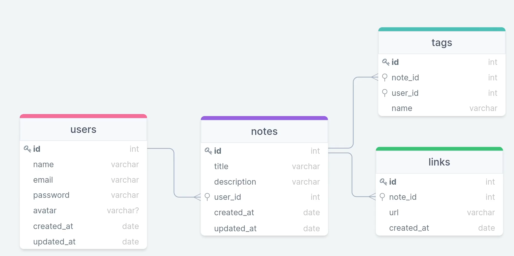
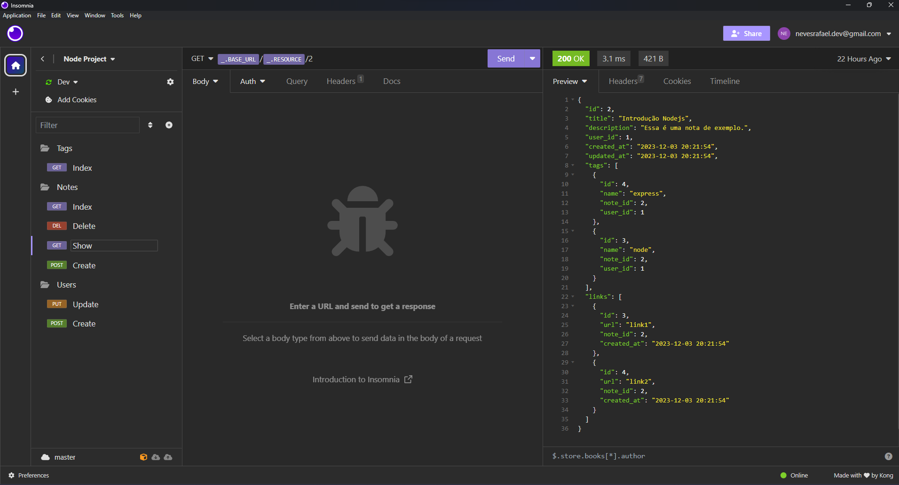
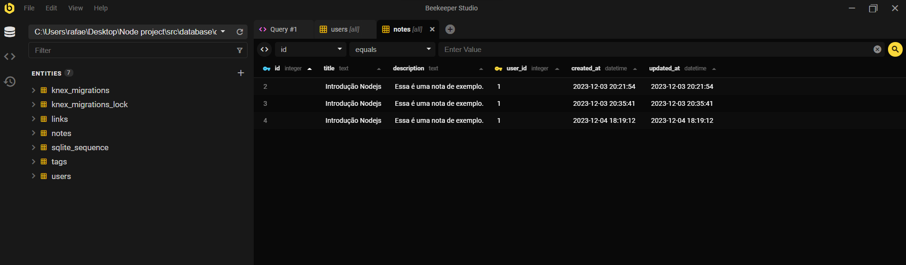
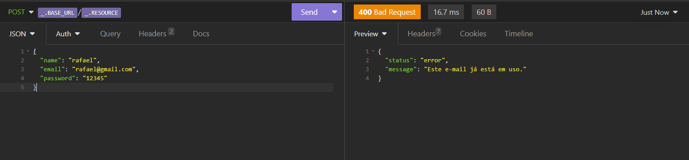

<h1 align="center">🌐 Rocket Notes</h1>




<p align="center">É uma aplicação Back-End que permite o cadastro de usuários em um banco de dados, adicionando notas, links e tags vinculados a esse mesmo usuário já existente!</p>
<br/>
<br/>
<p align="center">Utilizando Node.Js com o insomnia, beekeeper, SQLite3 e dependências como Express, Knex e Bcryptjs desenvolvi um Back-End com as funcionalidades CRUD. Tendo autenticações para verificação de usuários já existente e atualização dos dados.</p>
<br/>

<p align="center">Projeto desenvolvido durante o curso <strong>Explorer</strong> oferecida pela <a href="https://app.rocketseat.com.br/">RocketSeat</a>.<br/>
<br/>


<h1 align="center">⚙️Funcionalidades</h1>


<h3 align="center">⭐ Fazer a criação e atualização de usuários com IDs únicos!</h3>

<p align="center">
  
</p>

<h3 align="center">⭐ Criação, visualização e exclusão de Notas vinculadas aos usuários!</h3>
<p align="center">
  
</p>

<h3 align="center">⭐ Verificação de cada etapa retornando mensagem de erro personalizada para cada situação!</h3>
<p align="center">
  
</p>


<h2 align="center">🧱 Pré-requisitos</h2>
<br/>

<p align="center">Antes de começar, você vai precisar ter instalado em sua máquina as seguintes ferramentas: <a href="https://git-scm.com">Git</a>, insomnia, Beekeeper <br/>
Além disto é bom ter um editor para trabalhar com o código como <a href="https://code.visualstudio.com/">VSCode</a></p>
<br/>
<br/>
<h2 align="center">🎲 Rodando a aplicação</h2>
<br/>

<p align="center">

```bash
# Clone este repositório
$ git clone https://github.com/dsouloficial/Rocket-Notes-Back-End
$ npm install 
$ configure o package.json para utilizar o nodemon e o knex para iniciar a migrate

```
</p>
<br/>
<br/>

<h2 align="center">🛠 Tecnologias</h2>
<br/>

<p align="center">As seguintes ferramentas foram usadas na construção do projeto:<br/>
<br/>  
JavaScript - Node.js
<br/>
Insomnia - BeeKeeper - Sqlite3
<br/>
<br/>

<h1 align="center">📝 Licença</h1>

<p align="center">Este projeto esta sobe a licença MIT.</p>

<p align="center">Feito com ❤️ por Denilson Beranrdo👋🏽 <a href="https://www.linkedin.com/in/Dnilson-Bernardo-profile/">Entre em Contato</a></p>

